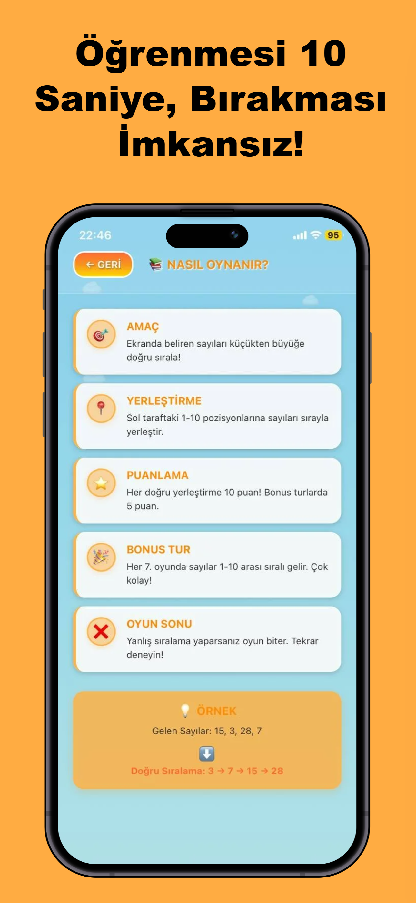
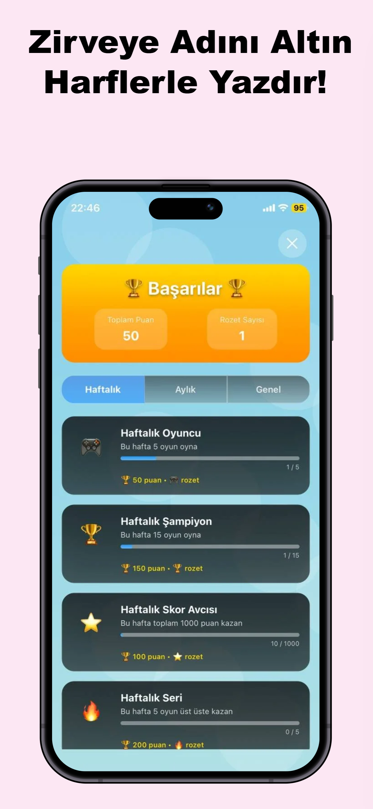
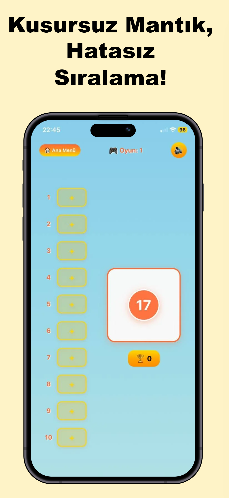
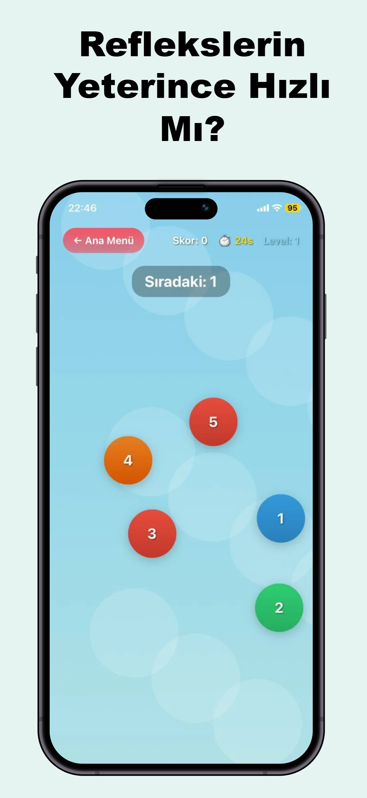

# YUXA — Number Ordering Game / Sayı Sıralama Oyunu

<div align="center">

**EN:** A fast, polished mobile puzzle: sort numbers from smallest to largest, chase high scores, unlock achievements, and compete on the global leaderboard.

**TR:** Sayıları küçükten büyüğe sıraladığınız hızlı ve akıcı bir mobil bulmaca: yüksek skor, başarımlar ve küresel skor tablosu.

[](https://expo.dev)
[](https://reactnative.dev)
[](https://www.typescriptlang.org/)

</div>

**Portfolio / CV:** Cross-platform **Expo + React Native + TypeScript** oyunu; **Firebase** skor tablosu, **EAS** ile mağaza derlemesi, **Expo Router** ile yapılandırılmış ekranlar.

---

## Screenshots / Ekran görüntüleri

Mağaza ve portföy için `assets/screens/` altında **iPhone** ekran görüntüleri (PNG). Ana akış: menü → oyun → skor / başarımlar / skor tablosu.

<p align="center">
<table>
<tr>
<td align="center" width="33%"></td>
<td align="center" width="33%"></td>
<td align="center" width="33%"></td>
</tr>
<tr>
<td align="center"></td>
<td align="center"></td>
<td align="center"></td>
</tr>
</table>
</p>

---

## English

### Overview

**YUXA** is a number-sorting brain game built with [Expo](https://expo.dev) and [React Native](https://reactnative.dev). It targets **iOS**, **Android**, and **web**, with Firebase used for leaderboard and related backend configuration.

This repo is set up for a **fresh install** and a **first store listing** under Android package `com.yuxa.sayisiralama` (version **1.0.0**, Android `versionCode` **1**). See `STORE_RELEASE_CHECKLIST.md` for a concise publish checklist.

### Features

- **Core gameplay** — Tap numbers in ascending order under time pressure; responsive layout tuned for many screen sizes.
- **Leaderboard** — Cloud-backed rankings via Firebase.
- **Achievements** — Progress and unlock flow with dedicated UI.
- **Polish** — Haptic feedback, sound (`expo-av`), animated background, glass-style UI, and safe-area aware layouts.
- **Routing** — [Expo Router](https://docs.expo.dev/router/introduction/) with typed routes.

### Tech stack

| Area | Stack |
|------|--------|
| Framework | Expo 54, React 19, React Native 0.81 |
| Navigation | Expo Router 6 |
| Backend (client) | Firebase JS SDK 11 |
| Storage (local) | Async Storage |
| UI / motion | Reanimated, Gesture Handler, Linear Gradient, Blur, Expo Image |

### Requirements

- **Node.js** (LTS recommended)
- **npm** (or compatible package manager)
- For native builds: **Android Studio** / **Xcode** per [Expo docs](https://docs.expo.dev/)

### Getting started

1. **Clone** the repository and open the project root.

2. **Install dependencies**

   ```bash
   npm install
   ```

3. **Environment variables**

   Create a `.env` file in the project root. Expo only exposes variables that start with `EXPO_PUBLIC_` to the client bundle:

   ```bash
   EXPO_PUBLIC_FIREBASE_API_KEY=your_api_key
   EXPO_PUBLIC_FIREBASE_AUTH_DOMAIN=your_project.firebaseapp.com
   EXPO_PUBLIC_FIREBASE_PROJECT_ID=your_project_id
   EXPO_PUBLIC_FIREBASE_STORAGE_BUCKET=your_project.appspot.com
   EXPO_PUBLIC_FIREBASE_MESSAGING_SENDER_ID=your_sender_id
   EXPO_PUBLIC_FIREBASE_APP_ID=your_app_id
   EXPO_PUBLIC_FIREBASE_MEASUREMENT_ID=your_measurement_id
   EXPO_PUBLIC_PRIVACY_POLICY_URL=https://your-deployment.vercel.app
   ```

   **`EXPO_PUBLIC_PRIVACY_POLICY_URL`:** Public HTTPS URL of your privacy policy (see `privacy-policy/` and `npm run deploy:privacy`). Required for store listings and the in-app “Gizlilik Politikası” link.

   **Security:** Do not commit real `.env` values to git. Rotate keys if they were ever exposed.

4. **Run the app**

   ```bash
   npm start
   # or
   npx expo start
   ```

   Then open in **Expo Go**, an **emulator/simulator**, or a **development build**.

5. **Native run (optional)**

   ```bash
   npm run android
   npm run ios
   ```

6. **Lint**

   ```bash
   npm run lint
   ```

**First-time device install:** After `npm install`, a clean phone install only needs a new build (EAS or local) and the correct `.env`; no migration from a previous app ID is required.

### EAS Build

This repo includes `eas.json` profiles (`development`, `preview`, `production`, etc.). Builds require the [EAS CLI](https://docs.expo.dev/build/introduction/) and an Expo account linked to the project.

### Store & links

- **Android:** Create a **new** Play Console app with package `com.yuxa.sayisiralama`, then upload your AAB. After the listing is live: [Google Play — YUXA](https://play.google.com/store/apps/details?id=com.yuxa.sayisiralama).

### Project layout (high level)

- `app/` — Screens, tabs, components, Firebase config, services (leaderboard, achievements)
- `assets/` — Images, fonts, app icon & splash (`images/logo-yuxa.png`)
- `assets/screens/` — Store / portfolio screenshots (`ios_1_1.png` … `ios_1_5.png`)
- `android/` — Native Android project (prebuild / local runs)

### Learn more

- [Expo documentation](https://docs.expo.dev/)
- [Expo Router](https://docs.expo.dev/router/introduction/)
- [Firebase for Web / JS](https://firebase.google.com/docs/web/setup)

### Expo template script (avoid here)

`npm run reset-project` is the default Expo starter reset: it **moves** your `app` folder to `app-example` and creates an empty `app`. **Do not run it** on this game project unless you intend to wipe the codebase.

---

## Türkçe

### Genel bakış

**YUXA**, [Expo](https://expo.dev) ve [React Native](https://reactnative.dev) ile geliştirilmiş bir sayı sıralama oyunudur. **iOS**, **Android** ve **web** platformlarını hedefler; skor tablosu ve ilgili yapılandırma için **Firebase** kullanılır.

Depo, **sıfırdan kurulum** ve **ilk mağaza yayını** için ayarlıdır: Android paket adı `com.yuxa.sayisiralama`, sürüm **1.0.0**, Android `versionCode` **1**. Kısa yayın listesi için `STORE_RELEASE_CHECKLIST.md` dosyasına bakın.

### Özellikler

- **Oynanış** — Süre baskısı altında sayıları küçükten büyüğe doğru seçme; farklı ekran boyutları için uyarlanmış arayüz.
- **Skor tablosu** — Firebase ile bulut tabanlı sıralama.
- **Başarımlar** — İlerleme ve kilidi açma akışı, ayrı başarım ekranı.
- **Deneyim** — Titreşim geri bildirimi, ses (`expo-av`), animasyonlu arka plan, cam efektli arayüz ve güvenli alan düzeni.
- **Yönlendirme** — Tür güvenli rotalar ile [Expo Router](https://docs.expo.dev/router/introduction/).

### Teknoloji özeti

| Alan | Teknoloji |
|------|-----------|
| Çatı | Expo 54, React 19, React Native 0.81 |
| Navigasyon | Expo Router 6 |
| Bulut (istemci) | Firebase JS SDK 11 |
| Yerel depolama | Async Storage |
| Arayüz / hareket | Reanimated, Gesture Handler, Linear Gradient, Blur, Expo Image |

### Gereksinimler

- **Node.js** (LTS önerilir)
- **npm** (veya uyumlu paket yöneticisi)
- Yerel derleme için: [Expo dokümantasyonuna](https://docs.expo.dev/) göre **Android Studio** / **Xcode**

### Kurulum

1. Depoyu **klonlayın** ve proje kök dizinine geçin.

2. **Bağımlılıkları yükleyin**

   ```bash
   npm install
   ```

3. **Ortam değişkenleri**

   Proje kökünde `.env` oluşturun. Expo, yalnızca `EXPO_PUBLIC_` ile başlayan değişkenleri istemci paketine dahil eder:

   ```bash
   EXPO_PUBLIC_FIREBASE_API_KEY=your_api_key
   EXPO_PUBLIC_FIREBASE_AUTH_DOMAIN=your_project.firebaseapp.com
   EXPO_PUBLIC_FIREBASE_PROJECT_ID=your_project_id
   EXPO_PUBLIC_FIREBASE_STORAGE_BUCKET=your_project.appspot.com
   EXPO_PUBLIC_FIREBASE_MESSAGING_SENDER_ID=your_sender_id
   EXPO_PUBLIC_FIREBASE_APP_ID=your_app_id
   EXPO_PUBLIC_FIREBASE_MEASUREMENT_ID=your_measurement_id
   EXPO_PUBLIC_PRIVACY_POLICY_URL=https://your-deployment.vercel.app
   ```

   **`EXPO_PUBLIC_PRIVACY_POLICY_URL`:** Gizlilik politikasının herkese açık HTTPS adresi (`privacy-policy/` klasörü ve `npm run deploy:privacy`). Mağaza girişi ve uygulama içi “Gizlilik Politikası” bağlantısı için gereklidir.

   **Güvenlik:** Gerçek `.env` değerlerini git’e eklemeyin. Anahtarlar sızdıysa Firebase konsolundan yenileyin.

4. **Uygulamayı çalıştırın**

   ```bash
   npm start
   # veya
   npx expo start
   ```

   Ardından **Expo Go**, **emülatör/simülatör** veya **development build** ile açın.

5. **Yerel native çalıştırma (isteğe bağlı)**

   ```bash
   npm run android
   npm run ios
   ```

6. **Lint**

   ```bash
   npm run lint
   ```

**İlk telefon kurulumu:** `npm install` sonrası temiz cihaza yüklemek için yeni bir derleme (EAS veya yerel) ve doğru `.env` yeterli; eski uygulama paketinden veri taşıma gerekmez.

### EAS derlemesi

Projede `eas.json` profilleri bulunur (`development`, `preview`, `production` vb.). Derlemeler için [EAS CLI](https://docs.expo.dev/build/introduction/) ve projeye bağlı Expo hesabı gerekir.

### Mağaza ve bağlantılar

- **Android:** Play Console’da paket adı **`com.yuxa.sayisiralama`** ile **yeni uygulama** açıp AAB yükleyin. Liste yayına alındıktan sonra mağaza bağlantısı çalışır: `https://play.google.com/store/apps/details?id=com.yuxa.sayisiralama`

### Klasör yapısı (özet)

- `app/` — Ekranlar, sekmeler, bileşenler, Firebase yapılandırması, servisler (skor tablosu, başarımlar)
- `assets/` — Görseller, fontlar, uygulama ikonu ve splash (`images/logo-yuxa.png`)
- `assets/screens/` — Mağaza ve portföy için ekran görüntüleri (`ios_1_1.png` … `ios_1_5.png`)
- `android/` — Yerel Android projesi

### Daha fazla bilgi

- [Expo dokümantasyonu](https://docs.expo.dev/)
- [Expo Router](https://docs.expo.dev/router/introduction/)
- [Firebase Web kurulumu](https://firebase.google.com/docs/web/setup)

### Expo şablon script’i (burada kullanmayın)

`npm run reset-project`, Expo’nun varsayılan sıfırlama komutudur: `app` klasörünü `app-example` altına **taşır** ve boş `app` oluşturur. Bu oyun projesinde **çalıştırmayın**; kod tabanını silersiniz.

---

## License / Lisans

This project is **private** (`"private": true` in `package.json`). Redistribution or publication of source code is subject to the repository owner’s policy.

Bu proje **özel**dir (`package.json` içinde `"private": true`). Kaynak kodun paylaşımı veya yayımı depo sahibinin politikasına tabidir.
